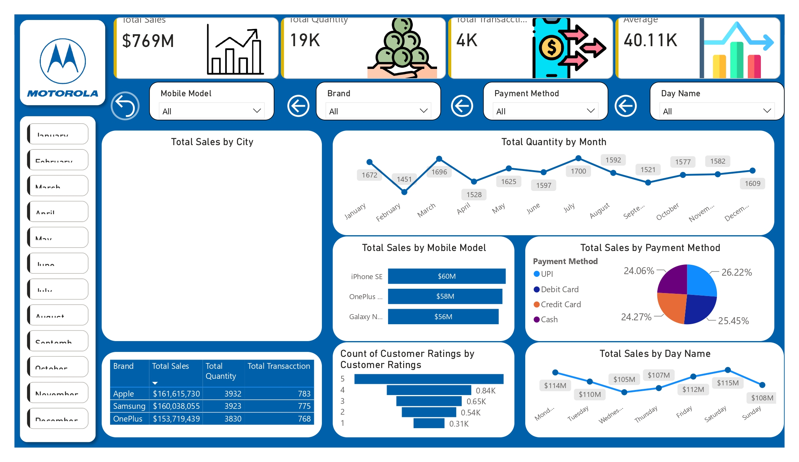

# 📱 Mobile Sales & Revenue Performance Dashboard

## Overview
This project provides a comprehensive analysis of retail mobile phone sales, transaction trends, customer rating distributions, and payment channel preferences. The goal was to build an interactive sales dashboard in Power BI to monitor key commercial metrics across top brands, mobile models, and payment methods.

## Tools & Technologies
- **Power BI Desktop:** KPI visual cards, dynamic slicers (Month, Brand, Payment Method), DAX calculations, and customized report layout
- **Power Query:** Data transformation, field formatting, and ETL logic
- **Microsoft Excel:** Source transactional dataset

---

## Key Metrics & Commercial Insights

### 1. Overall Revenue & Volume
- **Total Revenue Generated:** **$769M** across approximately 4,000 transactions.
- **Total Units Sold:** **19K mobile units**.
- **Average Order Value:** **$40.11K** per transaction batch.

### 2. Brand & Model Performance
- **Top Performing Brands:** 
  - **Apple:** Leads revenue at **$161.6M** (3,932 units across 783 transactions).
  - **Samsung:** **$160.0M** revenue (3,923 units across 775 transactions).
  - **OnePlus:** **$153.7M** revenue (3,830 units across 768 transactions).
- **Top Mobile Models by Revenue:** 
  1. iPhone SE (**$60M**)
  2. OnePlus models (**$58M**)
  3. Galaxy Note series (**$56M**)

### 3. Purchasing Patterns & Payment Methods
- **Monthly Seasonality:** Sales quantity peaked in **July (1,700 units)** and **March (1,696 units)**, with lower volume observed in February (1,451 units).
- **Weekly Revenue Trends:** Revenue peaks toward the end of the week, with **Saturday ($115M)** and **Monday ($114M)** driving highest revenue.
- **Payment Method Distribution:** Balanced mix across channels—**UPI (26.22%)**, **Debit Card (25.45%)**, **Credit Card (24.27%)**, and **Cash (24.06%)**.
- **Customer Ratings:** Strong customer sentiment, with **5-star ratings (840 reviews)** forming the largest single share of customer feedback.

---

## Dashboard Preview

---

## Business Recommendations
1. **Inventory Prioritization:** Maintain higher inventory stock for high-velocity models like iPhone SE and OnePlus devices during peak quarters (Q1 and Q3).
2. **Weekend Promotions:** Leverage high-volume sales days (Fridays and Saturdays) for targeted marketing campaigns and payment cashback offers.
3. **Digital Payment Incentives:** Partner with UPI and card providers to introduce targeted discounts, as digital channels drive over 75% of overall sales volume.
